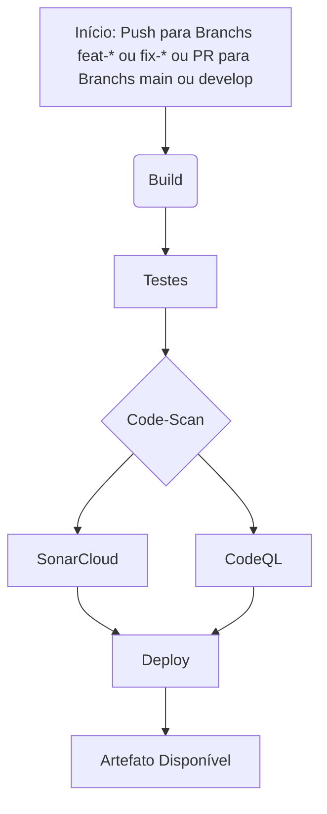

# Projeto Gerador de Jogos da Mega-Sena

## Descrição Geral

Este projeto é uma aplicação em Java para console que gera jogos aleatórios para a Mega-Sena, o famoso jogo de loteria brasileiro. Com uma interface simples de linha de comando, o programa solicita ao usuário o número de jogos que deseja gerar e exibe cada jogo com seis números aleatórios entre 1 e 60, garantindo que cada número não se repita dentro do mesmo jogo.

A aplicação foi desenvolvida para fins de prática com conceitos de desenvolvimento de software em Java, integração contínua (CI) e análise de qualidade de código.

## Funcionalidades

- Geração de números aleatórios para jogos da Mega-Sena.
- Entrada de usuário para definir o número de jogos a serem gerados.
- Garantia de que os números em cada jogo são únicos.

## Estrutura do Projeto

O projeto é composto pelas seguintes partes principais:

- **Gerador de Jogos**: Classe principal que realiza a geração dos números para cada jogo.
- **Testes Unitários**: Inclui testes automatizados para validar a funcionalidade de geração de números.
- **Pipeline de Integração Contínua (CI)**: Configurado com GitHub Actions para executar:
  - Build automatizado da aplicação.
  - Testes automatizados para verificar a integridade do código.
  - Análise de qualidade e segurança do código usando SonarCloud e CodeQL.
  - Deploy de artefato, disponibilizando o JAR da aplicação para download.

## Tecnologias Utilizadas

- **Java 17**: Linguagem de programação principal do projeto.
- **Maven**: Gerenciamento de dependências e automação de build.
- **GitHub Actions**: Configuração de CI para build, testes, análise de qualidade e deploy de artefatos.
- **SonarCloud e CodeQL**: Ferramentas de análise de qualidade e segurança do código.

## Como Executar

1. Clone o repositório: git clone https://github.com/seu-usuario/nome-do-repositorio.git

2. Compile o projeto usando Maven: mvn clean compile

3. Execute a aplicação: java -cp target/nome-do-jar.jar com.exemplo.megasena.MegaSenaApp

## Diagrama Pipeline CI/CD


## Contribuindo com o Projeto

Para garantir a qualidade e integridade do código, temos uma política de controle de branches. **Não é permitido fazer `push` direto nas branches `develop` e `main`**. Em vez disso, siga o fluxo abaixo para contribuir com o projeto:

1. **Crie uma nova branch de funcionalidade**:
   - Se você está adicionando uma nova funcionalidade, crie uma branch com o prefixo `feat-` seguido do nome da funcionalidade. Exemplo:
     ```bash
     git checkout -b feat-nova-funcionalidade
     ```
   - Se você está corrigindo um bug, crie uma branch com o prefixo `fix-` seguido da descrição do problema. Exemplo:
     ```bash
     git checkout -b fix-corrige-bug
     ```

2. **Faça as alterações e commits na sua branch**:
   - Utilize convenções de commits, como `feat`, `fix` para descrever suas alterações. Exemplo:
     ```bash
     git commit -m "feat: adiciona nova funcionalidade para geração de jogos"
     ```

3. **Abra uma Pull Request (PR)**:
   - Após concluir as alterações, faça o push da sua branch e abra uma Pull Request (PR) para `develop` ou `main`, dependendo do fluxo do projeto.
   - A PR deve passar pelas revisões e validações do pipeline CI/CD antes de ser mesclada.

4. **Aprovação e Merge**:
   - Somente após a aprovação de revisores e a conclusão dos checks de CI/CD, a PR poderá ser mesclada na `develop` ou `main`.

### Resumo do Controle de Branches

- **main**: Branch para versões estáveis e prontas para produção. **Não permite `push` direto.**
- **develop**: Branch principal para desenvolvimento e integração contínua. **Não permite `push` direto.**
- **feat-*** e **fix-***: Branches temporárias para desenvolvimento de funcionalidades e correções. Permitem `push` direto, mas precisam ser mescladas via PR.

Seguindo essas diretrizes, garantimos um processo de desenvolvimento colaborativo, seguro e de alta qualidade.

